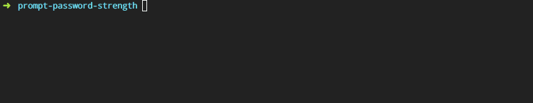

## Usage

```js
var Prompt = require('prompt-password');
var prompt = new Prompt({
  type: 'password',
  message: 'Enter your password',
  name: 'password',
  mask: require('')
});

prompt.run()
  .then(function(answer) {
    console.log(answer);
  });
```
